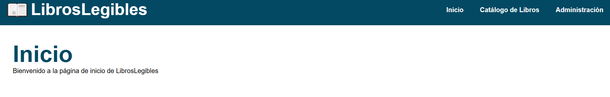
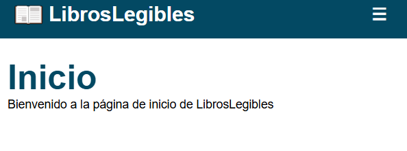
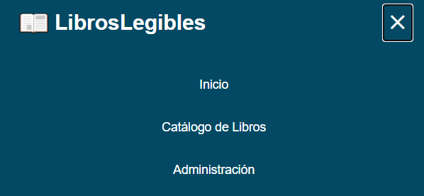
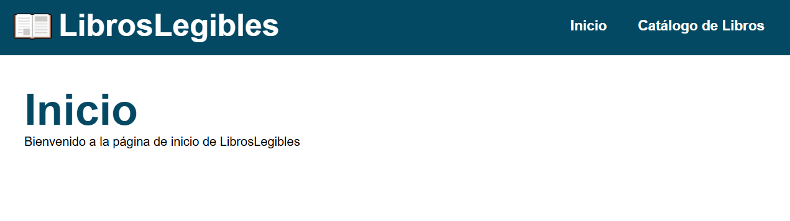
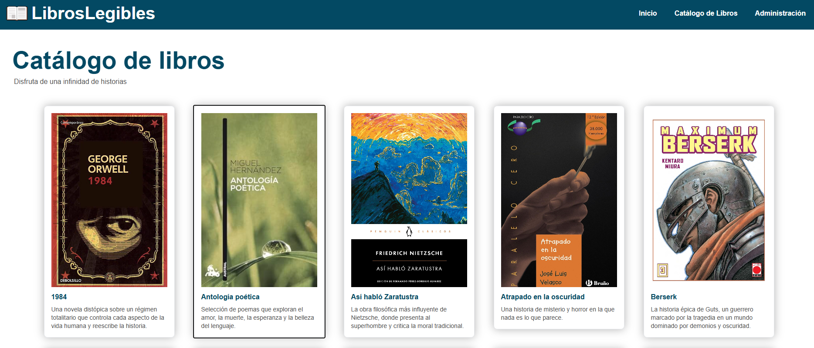
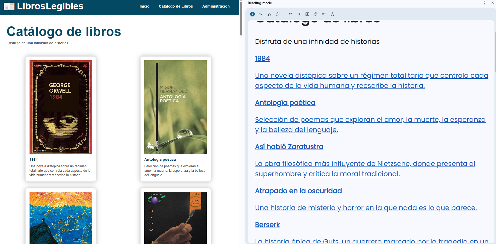
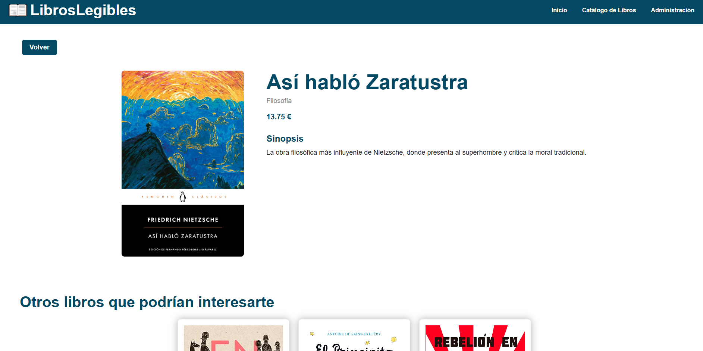

# LibrosLegibles

Alumno: 
**Diego Fernando Valencia Correa 2ºK**

---

## Elementos de la página web y pruebas de accesibilidad

Aquí podemos ver la barra de navegación de la página web, esta cambia de tamaño en los textos y el icono según va disminuyendo el tamaño. Además, cuando se hace lo suficientemente pequeño (tamaño tablet o móvil), aparece un menú de hamburguesa para facilitar la navegación en pantallas pequeñas.

Todos estos elementos son navegables por tabulación

 

 

 

También podemos ver que existe la misma barra de navegación para usuarios no autenticados. Se puede alternar entre ambas cambiando la variable isAuthenticated en el archivo app.js

 

Aquí está el pie de página.

 

Este es el catálogo de libros. También navegable por teclado y funcional para el lector de pantalla (como los demás elementos de la página)

 

 

Por otra parte también hay un link que nos permite saltar al contenido principar de la página para no tener que pasar por todos los elementos de la barra de navegación.

 

También existe una página de detalle para los libros. Esta contiene un botón para volver al elemento anterior. Y libros recomendados en la parte inferior.

